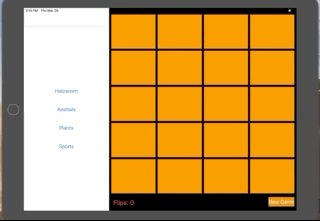

# Concentration

## Overview
App represents a digital version of classic game, where the goal is to find matching pair of cards. 
Implemented as a both iPhone and iPad app.

## Implemented Bits
* use of splitViewController to support both iPhone and iPad 
* use of master and detail
* segue
* split view controller delegate methods
* keep reference of controlelle so that it stays in the heap
* design game engine 
* conform to hashable protocol
* using static functions
* using lazy variables
